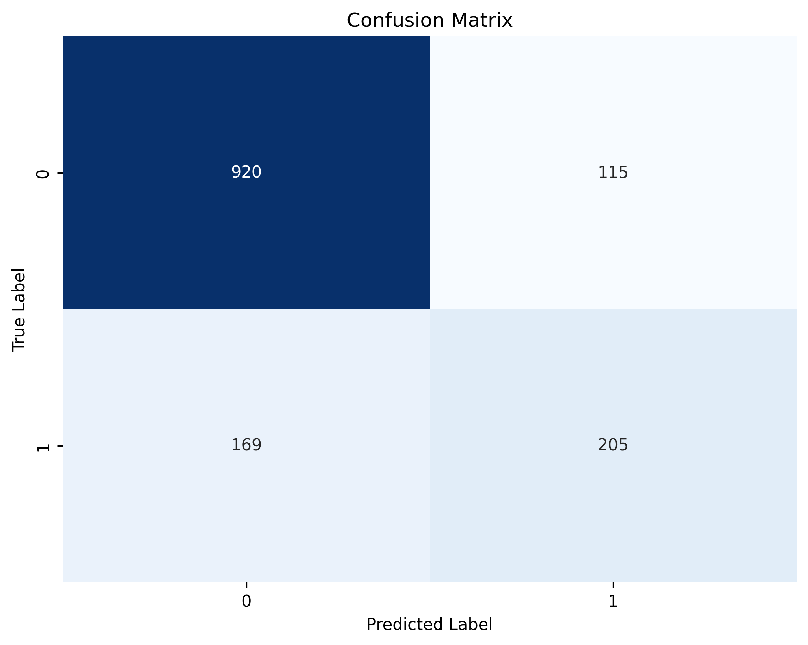
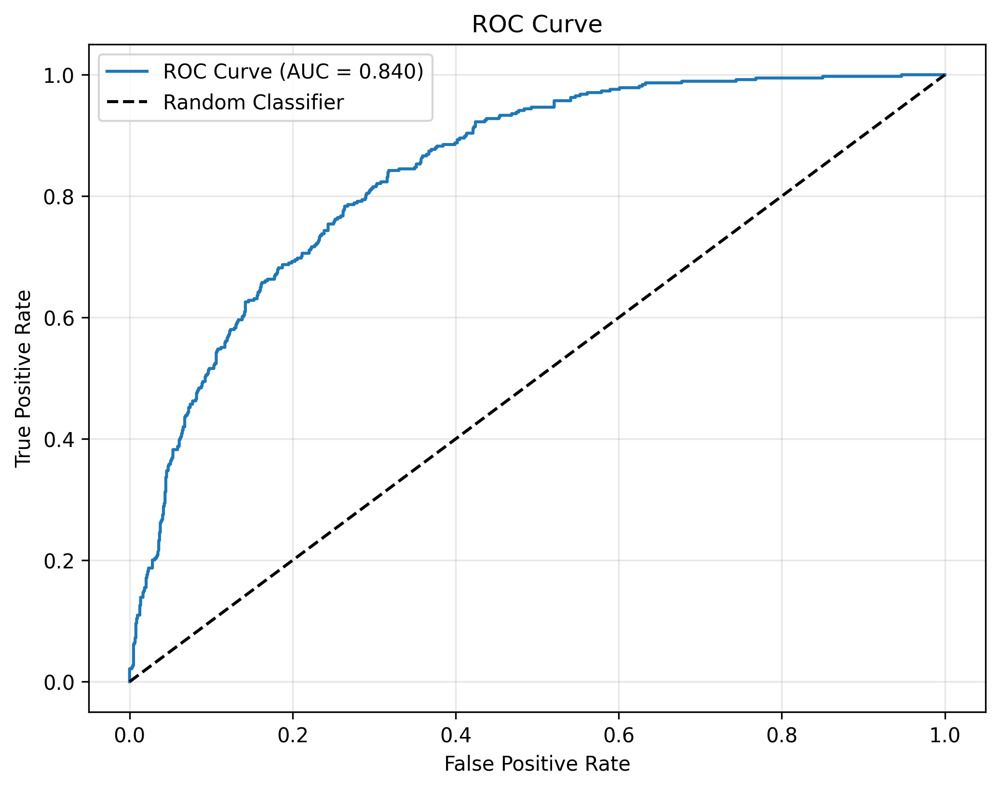
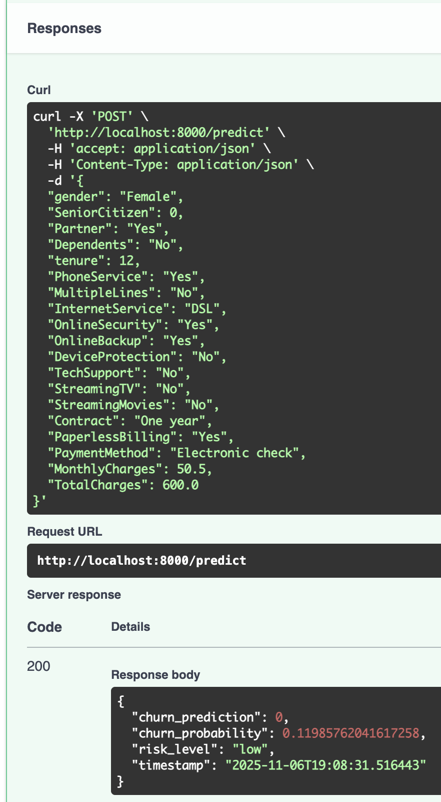
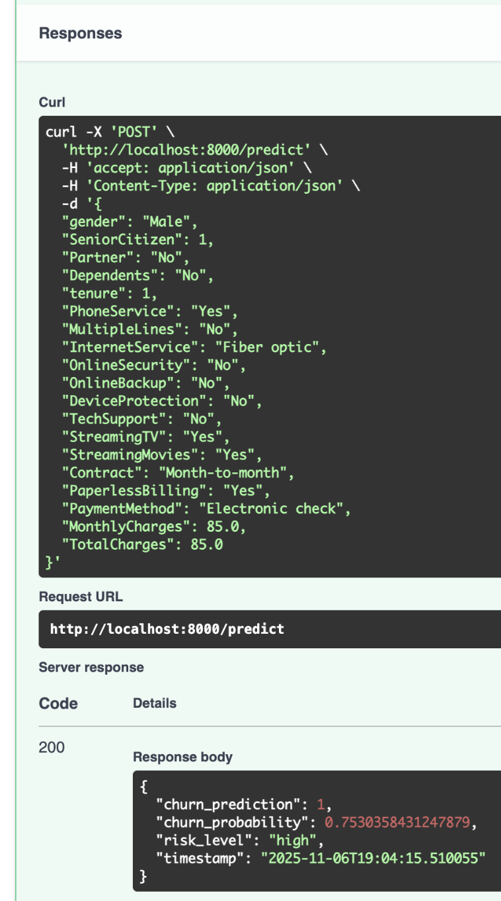

# 🎯 Customer Churn Prediction - MLOps System


## 🚀 Project Overview

This project implements an end-to-end MLOps pipeline for predicting customer churn in a telecommunications company. The system processes 7,043 customer records, trains multiple ML models, and serves predictions via a REST API.

**Key Achievement:** Identified that **tenure, monthly charges, and contract type** are the strongest predictors of customer churn.

## 📊 Model Performance

### Metrics
- **ROC-AUC:** 84.0% ⭐
- **Accuracy:** 79.8%
- **Precision:** 64.1%
- **Recall:** 54.8%
- **F1-Score:** 59.1%

### Evaluation Results

**Confusion Matrix**  


**ROC Curve**  


**Feature Importance**  


## 🎯 Live API Demo

**Low-Risk Customer Prediction:**  


**High-Risk Customer Prediction:**  


## 🏗️ Architecture
```
┌─────────────┐      ┌──────────────┐      ┌─────────────┐
│   Raw Data  │─────▶│ Preprocessing │─────▶│   Training  │
│   (7,043)   │      │   Pipeline    │      │  (3 Models) │
└─────────────┘      └──────────────┘      └─────────────┘
                                                    │
                                                    ▼
                                            ┌─────────────┐
                                            │   MLflow    │
                                            │   Tracking  │
                                            └─────────────┘
                                                    │
                                                    ▼
┌─────────────┐      ┌──────────────┐      ┌─────────────┐
│   FastAPI   │◀─────│  Best Model  │◀─────│   Model     │
│     API     │      │   (Logistic) │      │   Registry  │
└─────────────┘      └──────────────┘      └─────────────┘
```

## 🛠️ Technologies Used

- **ML/Data:** Python, scikit-learn, XGBoost, pandas, numpy
- **MLOps:** MLflow (experiment tracking), DVC (data versioning)
- **API:** FastAPI, Uvicorn, Pydantic
- **Deployment:** Docker, Docker Compose
- **Monitoring:** Prometheus, Grafana
- **Testing:** pytest, pytest-cov
- **Visualization:** matplotlib, seaborn, plotly

## 📦 Project Structure
```
ml-churn-prediction/
├── src/
│   ├── features/           # Data preprocessing & feature engineering
│   ├── models/             # Model training, evaluation, prediction
│   ├── api/                # FastAPI application
│   ├── monitoring/         # Performance monitoring
│   └── utils/              # Helper functions
├── data/
│   ├── raw/                # Original dataset
│   ├── processed/          # Processed data
│   └── models/             # Saved models & evaluation
├── tests/                  # Test suite
├── config/                 # Configuration files
├── Dockerfile              # Container definition
├── docker-compose.yml      # Multi-container setup
└── README.md
```

## 🚀 Quick Start

### Prerequisites
- Python 3.12+
- pip
- Docker (optional)

### Installation
```bash
# Clone repository
git clone https://github.com/YOUR_USERNAME/ml-churn-prediction.git
cd ml-churn-prediction

# Create virtual environment
python3 -m venv venv
source venv/bin/activate  # On Windows: venv\Scripts\activate

# Install dependencies
pip install -r requirements.txt

# Download dataset
python src/utils/download_data.py

# Train model
python src/features/preprocessing.py
python src/models/train.py

# Start API
python -m uvicorn src.api.main:app --reload
```

### Usage

**Access API Documentation:**
```
http://localhost:8000/docs
```

**Make a Prediction:**
```bash
curl -X POST "http://localhost:8000/predict" \
  -H "Content-Type: application/json" \
  -d '{
    "gender": "Female",
    "SeniorCitizen": 0,
    "Partner": "Yes",
    "tenure": 12,
    "Contract": "One year",
    "MonthlyCharges": 50.5,
    ...
  }'
```

**Response:**
```json
{
  "churn_prediction": 0,
  "churn_probability": 0.119,
  "risk_level": "low",
  "timestamp": "2025-11-06T19:08:31"
}
```

## 🐳 Docker Deployment
```bash
# Build and run
docker-compose up --build

# Access services
# API: http://localhost:8000
# MLflow: http://localhost:5000
# Prometheus: http://localhost:9090
# Grafana: http://localhost:3000
```

## 📈 Key Insights

### Top Churn Predictors
1. **Tenure** - New customers (< 12 months) are high risk
2. **Contract Type** - Month-to-month contracts have 3x higher churn
3. **Monthly Charges** - Customers paying $70+ are more likely to leave
4. **Services** - Lack of OnlineSecurity and TechSupport increases risk

### Business Recommendations
- Target retention efforts at customers in their first year
- Incentivize annual contracts with discounts
- Proactively offer support services to high-paying customers
- Focus on customers with month-to-month contracts

## 🧪 Testing
```bash
# Run all tests
pytest tests/ -v

# With coverage
pytest --cov=src --cov-report=html
```

## 📊 Model Comparison

| Model | ROC-AUC | Accuracy | Precision | Recall |
|-------|---------|----------|-----------|--------|
| Logistic Regression | **0.840** ⭐ | 79.8% | 64.1% | 54.8% |
| Random Forest | 0.837 | 80.0% | 65.8% | 51.3% |
| XGBoost | 0.837 | 79.8% | 64.4% | 53.2% |

**Best Model:** Logistic Regression selected for production deployment.

## 🎯 Features

- ✅ Automated data preprocessing pipeline
- ✅ Multiple ML algorithms (Logistic Regression, Random Forest, XGBoost)
- ✅ Experiment tracking with MLflow
- ✅ REST API with FastAPI
- ✅ Interactive API documentation (Swagger UI)
- ✅ Docker containerization
- ✅ Model evaluation with comprehensive metrics
- ✅ Feature importance analysis
- ✅ Production-ready error handling
- ✅ Comprehensive test suite

## 📝 License

This project is licensed under the MIT License.

## 👤 Author

**Harjeet Chahal**
- GitHub: [@YOUR_USERNAME](https://github.com/YOUR_USERNAME)
- LinkedIn: [Your LinkedIn](https://linkedin.com/in/your-profile)

## 🙏 Acknowledgments

- Dataset: [Telco Customer Churn](https://www.kaggle.com/datasets/blastchar/telco-customer-churn)
- Inspired by production ML systems at leading tech companies

---

⭐ **Star this repo if you find it helpful!**
# CI/CD Test
